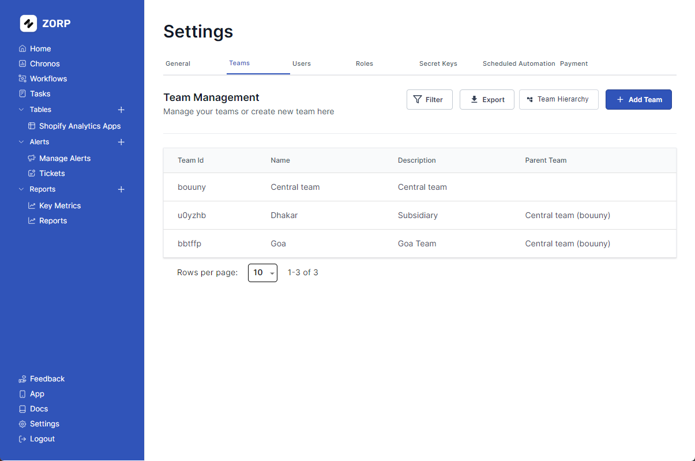

# Managing Teams

Managing teams is a critical part of any organization. Zorp let's you assign teams to your users and manage their access to the platform.

## Creating a Team

1. To create a new team, click on the `settings` tab on the left sidebar
2. Click on the `Teams` tab
3. Click on the `Add Team` button
4. Fill in the team details **Parent Team refers to the team that the team you want to create belongs to**
5. Click on the `Create Team` button

